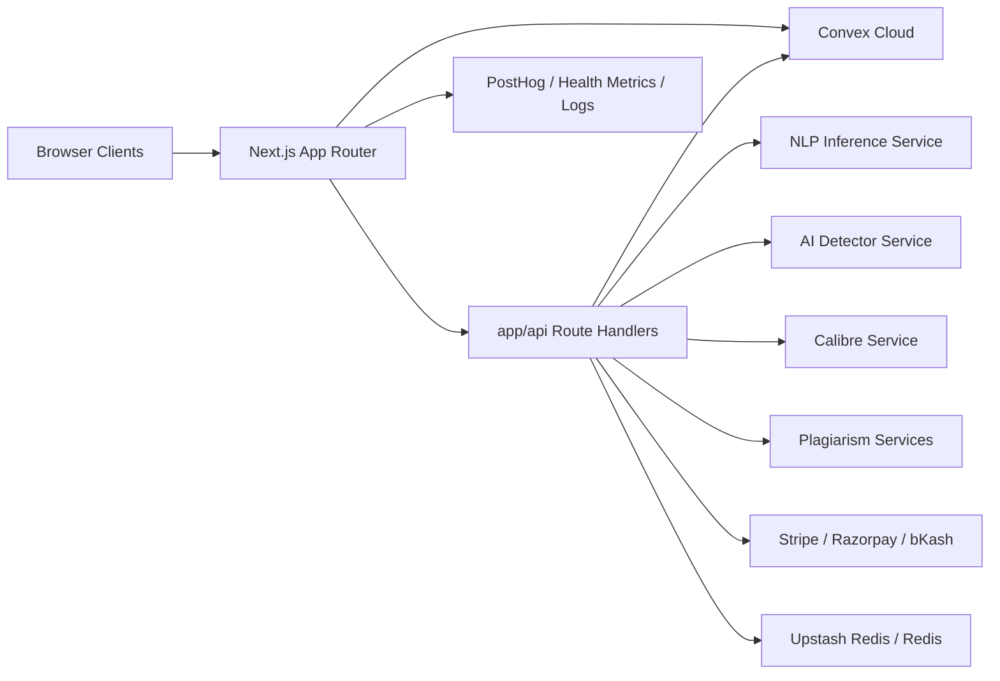
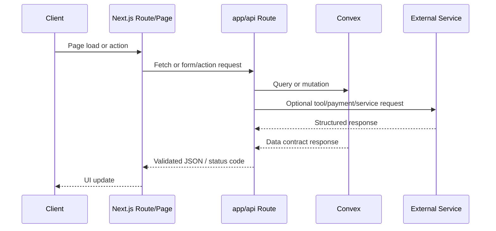

# Shothik Web

Standalone web application repository for the active Shothik AI product experience.

This project contains the production-facing Next.js application, frontend API routes, active Convex integration, and the supporting UI, state, and integration layers required to run the Shothik AI web platform independently from the original monorepo.

## Table Of Contents

- [Overview](#overview)
- [Architecture](#architecture)
- [Repository Structure](#repository-structure)
- [Technology Stack](#technology-stack)
- [Local Development Setup](#local-development-setup)
- [Production Deployment](#production-deployment)
- [Cloud Infrastructure Requirements](#cloud-infrastructure-requirements)
- [API Documentation](#api-documentation)
- [Environment Variables](#environment-variables)
- [Dependencies And Compatibility Notes](#dependencies-and-compatibility-notes)
- [Testing And Quality Gates](#testing-and-quality-gates)
- [Continuous Integration](#continuous-integration)
- [Troubleshooting](#troubleshooting)
- [Security And Compliance](#security-and-compliance)
- [Performance And Monitoring](#performance-and-monitoring)
- [Additional Documentation](#additional-documentation)

## Overview

`shothik-web` is a full web application repo, not just a UI library. It includes:

- marketing and account-facing pages
- authenticated application pages
- tool interfaces such as paraphrasing, plagiarism, grammar, summarization, and translation
- agent and Twin workflows
- payment and publishing flows
- frontend API routes under `app/api`
- active Convex data functions under `convex`

This repo intentionally excludes:

- standalone backend microservices
- legacy root `convex/`
- vendor bundles and process-only directories from the old monorepo

## Architecture

### System Diagram



### Request Flow



### Design Principles

- **App Router first**: routes, layouts, server rendering, and API handlers live under `app/`
- **Frontend-coupled data layer**: `convex/` remains in this repo because the active product depends on it directly
- **Thin route handlers where possible**: route handlers should orchestrate validation, auth, and external calls, not duplicate domain logic
- **Strong env-driven integrations**: payments, Convex, Redis, and external services must be configured via environment variables
- **Test and build in repo scope**: run validation from this repo directly, not via the old monorepo root

## Repository Structure

```text
shothik-web/
  app/                   Next.js routes, layouts, pages, API endpoints
  components/            UI primitives and feature/domain components
  convex/                Active Convex functions and generated bindings
  hooks/                 React hooks and app orchestration hooks
  lib/                   Shared frontend logic, integrations, validation, security
  providers/             App-level providers and wrappers
  redux/                 State slices and store setup
  services/              Browser/server integration adapters
  test/                  Test setup and shared test helpers
  public/                Static assets
  docs/                  Engineering and rollout documentation
  Dockerfile             Container build for the web app
  .env.example           Environment variable reference
  package.json           Repo-local scripts and dependencies
```

## Technology Stack

### Core Framework

- Next.js `16.2.3`
- React `19.2.0`
- TypeScript `5.x`

### State And Data

- Convex
- Redux Toolkit
- TanStack Query

### UI

- Tailwind CSS `4.x`
- Radix UI
- TipTap
- Framer Motion

### Tooling

- Vitest
- Playwright
- ESLint
- Prettier
- pnpm `10.x`

### External Integrations

- Stripe
- Razorpay
- bKash
- Upstash Redis / Redis
- PostHog
- MCP / LiteParse / document parsing integrations

## Local Development Setup

### Prerequisites

- Node.js `20.x` LTS
- pnpm `10.x`
- Docker Desktop or compatible container runtime
- Access to required external services for full integration testing:
  - Convex deployment
  - payment provider sandbox credentials
  - Redis / Upstash
  - external microservice endpoints

### Install

```bash
pnpm install
```

### Configure Environment

```bash
cp .env.example .env.local
```

At minimum for most local flows, set:

- `NEXT_PUBLIC_CONVEX_URL`
- `NEXT_PUBLIC_CLERK_PUBLISHABLE_KEY`
- `CLERK_SECRET_KEY`
- `STRIPE_SECRET_KEY` if testing payment routes
- backend service URLs if calling local service containers

### Run The App

```bash
pnpm dev
```

### Repo-Scoped Validation

```bash
pnpm type-check
pnpm test
NEXT_PUBLIC_CONVEX_URL=https://placeholder.convex.cloud STRIPE_SECRET_KEY=sk_test_placeholder pnpm build
```

Use placeholder secrets only for build validation when routes instantiate SDKs at module scope. Real runtime usage requires valid secrets.

## Production Deployment

### Supported Deployment Modes

- containerized deployment on ECS, Cloud Run, Azure Container Apps, Kubernetes, or similar
- managed Node-compatible platform deployment with environment injection

### Production Build Procedure

```bash
pnpm install --frozen-lockfile
pnpm type-check
pnpm test
pnpm build
```

### Container Build

```bash
docker build -t shothik-web .
docker run --rm -p 3000:3000 --env-file .env.production shothik-web
```

### Deployment Checklist

- verify production environment variables are present
- confirm Convex deployment URL and deploy key alignment
- confirm payment webhooks and callback URLs match production domain
- confirm Redis or Upstash access works from the runtime network
- verify health endpoints before shifting traffic
- verify monitoring and alerting targets are active

### Environment-Specific Guidance

**Development**
- local `.env.local`
- optional local service URLs
- debugging and test tooling enabled

**Staging**
- sandbox payment providers
- production-like Convex and Redis
- smoke tests and UAT required before promotion

**Production**
- secrets from a managed secret store
- no local fallback credentials
- strict alerting on health, latency, and payment failures

## Cloud Infrastructure Requirements

### Minimum Runtime Requirements

- Linux container runtime
- Node.js `20.x`
- outbound network access to:
  - Convex
  - payment providers
  - microservice APIs
  - analytics / monitoring backends

### Recommended Managed Services

- **CDN / Edge**: Vercel, CloudFront, or equivalent
- **Secrets**: AWS Secrets Manager, GCP Secret Manager, Azure Key Vault, Doppler, or Vault
- **Cache / Rate limiting**: Upstash Redis or managed Redis
- **Observability**: PostHog, centralized logs, uptime checks, metrics dashboard

### Networking Requirements

- HTTPS termination
- egress allow-list for third-party providers where possible
- webhook ingress routes for Stripe / bKash / PublishDrive and similar integrations

### Persistence / External State

- Convex remains the main active data contract for the web app
- Redis / Upstash used for caching, rate limiting, and idempotency
- payment providers maintain their own transactional state

## API Documentation

### API Surface

This repo serves API handlers from `app/api/**`.

OpenAPI / Swagger entry points:

- `/api-docs`
- `/api/docs/swagger.json`

### Authentication Modes

The route layer currently uses several auth patterns:

- **Bearer token** from `Authorization` header
- **Clerk-backed user auth**
- **Agent API keys** beginning with `shothik_agent_`
- **Webhook signature validation** for payment or external callbacks
- **Admin key** for selected metrics endpoints

Reference auth helpers:

- [auth.ts](file:///Users/macos/Downloads/shothik-platfrom1%204/fresh-repos/shothik-web/lib/auth.ts)
- [agent-auth.ts](file:///Users/macos/Downloads/shothik-platfrom1%204/fresh-repos/shothik-web/lib/agent-auth.ts)

### Route Groups

| Group | Example Endpoints | Auth | Purpose |
| --- | --- | --- | --- |
| Health | `/api/health`, `/api/health-check` | public / admin-key for metrics | liveness, dependency checks, runtime metrics |
| Tool APIs | `/api/tools/paraphrase`, `/api/tools/plagiarism/analyze`, `/api/tools/translator` | bearer or app auth depending on tool | core AI tooling |
| Publishing | `/api/publish/submit`, `/api/publish/status`, `/api/books/export/validate` | bearer / agent key | manuscript processing and publishing workflows |
| Payments | `/api/stripe/*`, `/api/razorpay/*`, `/api/bkash/*` | provider auth + app auth | checkout, payout, webhooks |
| Twin / Agent | `/api/twin/*` | bearer / agent key | skills, tasks, identity, activity |
| Research / Sheet | `/api/research/chat/*`, `/api/sheet/*` | bearer | workflow history and session APIs |
| Docs / Metadata | `/api/docs/swagger.json`, `/api/templates`, `/api/geolocation` | mixed | support, docs, utility |

### Representative Request / Response Examples

#### Health Check

`GET /api/health`

Response:

```json
{
  "status": "ok",
  "timestamp": "2025-01-01T00:00:00.000Z",
  "uptime": 12345.67
}
```

Deep health:

`GET /api/health?deep=true`

Metrics mode:

`GET /api/health?metrics=true`

Headers:

```http
x-admin-key: <metrics-admin-key>
```

#### Paraphrase Tool

`POST /api/tools/paraphrase`

Headers:

```http
Authorization: Bearer <token>
Content-Type: application/json
```

Example body:

```json
{
  "text": "Rewrite this paragraph clearly.",
  "mode": "fluency",
  "language": "en"
}
```

Representative response:

```json
{
  "output": "A clearer rewritten paragraph.",
  "mode": "fluency",
  "cached": false
}
```

#### Publishing Validation

`POST /api/books/export/validate`

Headers:

```http
Authorization: Bearer <token>
Content-Type: application/json
```

Body:

```json
{
  "bookId": "book_123",
  "fix": false
}
```

Representative response:

```json
{
  "fixed": false,
  "score": 92,
  "issues": [],
  "ready_for": ["epub", "distribution"]
}
```

#### Stripe Connect

`POST /api/stripe/connect`

Headers:

```http
Authorization: Bearer <token>
Content-Type: application/json
```

Representative response:

```json
{
  "url": "https://connect.stripe.com/setup/..."
}
```

### API Route Development Guidance

- validate request bodies and query params before side effects
- return stable JSON error shapes
- avoid top-level SDK initialization unless env guards are present
- prefer lazy client creation for Stripe, Convex, Redis, and payment SDKs
- always set explicit timeouts for external fetches
- instrument critical routes with health and metrics visibility

## Environment Variables

The full reference lives in [`.env.example`](file:///Users/macos/Downloads/shothik-platfrom1%204/fresh-repos/shothik-web/.env.example).

### Required In Most Deployments

| Variable | Purpose | Required |
| --- | --- | --- |
| `NEXT_PUBLIC_CONVEX_URL` | Convex URL for frontend and API route access | Yes |
| `CONVEX_DEPLOYMENT` | Convex deployment name | Usually |
| `CLERK_SECRET_KEY` | server-side auth | Yes for protected routes |
| `NEXT_PUBLIC_CLERK_PUBLISHABLE_KEY` | client-side auth | Yes |
| `STRIPE_SECRET_KEY` | Stripe server operations | Yes if Stripe routes enabled |
| `STRIPE_WEBHOOK_SECRET` | webhook verification | Yes if Stripe webhooks enabled |
| `REDIS_URL` / `REDIS_TOKEN` | caching, idempotency, rate limits | Recommended / required for some protections |

### Service Endpoint Variables

| Variable | Default / Example | Purpose |
| --- | --- | --- |
| `NLP_SERVICE_URL` | `http://localhost:3001` | NLP inference backend |
| `AI_DETECTOR_SERVICE_URL` | `http://localhost:3002` | AI detector backend |
| `CALIBRE_SERVICE_URL` | `http://localhost:3003` | ebook / conversion backend |
| `NEXT_PUBLIC_API_URL` | production API base | backend health / integration calls |

### Payments And Business Integrations

- Stripe keys
- Razorpay key and secret
- bKash base URL and credentials
- PublishDrive webhook and publication settings where applicable

### Optional Observability / Feature Flags

- PostHog keys
- monitoring keys
- feature-flag toggles

## Dependencies And Compatibility Notes

### Core Versions

| Dependency | Version |
| --- | --- |
| Node.js | `20.x` recommended |
| pnpm | `10.x` |
| Next.js | `16.2.3` |
| React | `19.2.0` |
| TypeScript | `5.x` |
| Vitest | `4.x` |
| Playwright | `1.57.x` |

### Important Compatibility Notes

- `swagger-ui-react` currently pulls peer warnings with React 19 through transitive packages
- some API routes instantiate Stripe and Convex clients at module scope, which means build-time env placeholders may be required during CI builds
- extracted repo validation revealed previously hoisted dependencies that are now declared locally:
  - `uuid`
  - `@casl/ability`
  - `@upstash/redis`
  - `pdf-parse`
  - `razorpay`
  - `form-data`

Use [package.json](file:///Users/macos/Downloads/shothik-platfrom1%204/fresh-repos/shothik-web/package.json) as the source of truth for the full dependency list.

## Testing And Quality Gates

Primary commands:

```bash
pnpm type-check
pnpm test
```

Coverage config currently lives in:

- [vitest.config.ts](file:///Users/macos/Downloads/shothik-platfrom1%204/fresh-repos/shothik-web/vitest.config.ts)

Current global thresholds:

- lines: `40`
- functions: `40`
- branches: `30`
- statements: `40`

These are the current enforced floors, not the long-term target standard.

See:

- [TEST_CASE_DOCUMENTATION.md](file:///Users/macos/Downloads/shothik-platfrom1%204/fresh-repos/shothik-web/docs/TEST_CASE_DOCUMENTATION.md)

## Continuous Integration

Initial CI workflow:

- [ci.yml](file:///Users/macos/Downloads/shothik-platfrom1%204/fresh-repos/shothik-web/.github/workflows/ci.yml)

The workflow currently runs:

- dependency install with frozen lockfile
- TypeScript type-check
- test coverage run
- production build with safe placeholder env values
- optional Playwright smoke execution on manual dispatch

### Local Pre-PR Validation

Run the same core checks locally before pushing:

```bash
pnpm install
pnpm type-check
pnpm test:coverage
NEXT_PUBLIC_CONVEX_URL=https://placeholder.convex.cloud STRIPE_SECRET_KEY=sk_test_placeholder pnpm build
```

### Branch Strategy

Recommended working branches:

- `feat/*`
- `fix/*`
- `chore/*`
- `docs/*`
- `refactor/*`
- `test/*`

## Troubleshooting

### `Cannot find module ...` after extraction

Cause:

- dependency was previously satisfied by monorepo hoisting

Fix:

- add the dependency directly to this repo’s `package.json`
- reinstall with `pnpm install`

### Build fails with undefined Convex deployment address

Cause:

- `NEXT_PUBLIC_CONVEX_URL` missing during build and some routes create a Convex client at module scope

Fix:

- set `NEXT_PUBLIC_CONVEX_URL` in CI and local build environments

### Build fails with Stripe authenticator missing

Cause:

- `STRIPE_SECRET_KEY` missing while a route initializes Stripe at import time

Fix:

- set `STRIPE_SECRET_KEY` in build environment
- long term: move SDK creation behind lazy initialization

### `pnpm install` inherits parent workspace

Cause:

- extracted repo lives inside another monorepo tree

Fix:

- keep local `pnpm-workspace.yaml` with `packages: ["."]`
- or move the repo outside the old monorepo entirely before push

### Health route reports degraded environment

Cause:

- required env variables or dependent services are missing

Fix:

- inspect `/api/health?deep=true`
- inspect `/api/health?metrics=true` with admin key if configured

## Security And Compliance

### Required Practices

- store all secrets in managed secret stores, never in source control
- validate all request bodies before external side effects
- verify webhook signatures for payment providers
- use bearer token validation consistently
- redact or sanitize PII when logging or persisting freeform text
- enforce rate limiting and idempotency on payment and mutation-heavy routes

### Existing Security Signals In Repo

- PII detection and sanitization helpers in `lib/agent-auth.ts`
- idempotency helpers in `lib/security/idempotency.ts`
- OWASP and security utilities in `lib/security/*`
- rate limiting and resiliency helpers in `lib/rateLimiter.ts` and related modules

### Compliance Guidance

- treat user text as sensitive content
- minimize log payloads
- enforce least privilege for payment and data integrations
- review third-party SDKs quarterly
- document data retention and deletion policies for each external integration

## Performance And Monitoring

### Performance Guidance

- avoid heavyweight SDK initialization at module scope
- keep API route fetches behind explicit timeout budgets
- use caching where result reuse is safe
- keep SSR payloads lean and avoid unnecessary client bundles
- monitor document parsing and payment flows separately from standard page traffic

### Monitoring Setup

Existing monitoring entry points:

- `/api/health`
- `/api/health?deep=true`
- `/api/health?metrics=true`

Track at minimum:

- p50 / p95 / p99 route latency
- external dependency availability
- failed payment callbacks
- Convex connectivity
- cache hit/miss behavior
- build-time env validation failures

### Alert Recommendations

- alert on health route `503`
- alert on error rate spikes by route group
- alert on payment webhook failures
- alert on sustained latency degradation for `/api/tools/*` and `/api/twin/*`

## Additional Documentation

- [TEST_CASE_DOCUMENTATION.md](file:///Users/macos/Downloads/shothik-platfrom1%204/fresh-repos/shothik-web/docs/TEST_CASE_DOCUMENTATION.md)
- [FUTURE_WORK_ROADMAP.md](file:///Users/macos/Downloads/shothik-platfrom1%204/fresh-repos/shothik-web/docs/FUTURE_WORK_ROADMAP.md)
- [CI_CD_SECURITY_HARDENING.md](file:///Users/macos/Downloads/shothik-platfrom1%204/fresh-repos/shothik-web/docs/CI_CD_SECURITY_HARDENING.md)
- [BRANCH_PROTECTION_POLICY.md](file:///Users/macos/Downloads/shothik-platfrom1%204/fresh-repos/shothik-web/docs/BRANCH_PROTECTION_POLICY.md)
- [COVERAGE_IMPROVEMENT_PLAN.md](file:///Users/macos/Downloads/shothik-platfrom1%204/fresh-repos/shothik-web/docs/COVERAGE_IMPROVEMENT_PLAN.md)
- [PARAPHRASE_PLAGIARISM_MODERNIZATION_ROLLOUT.md](file:///Users/macos/Downloads/shothik-platfrom1%204/fresh-repos/shothik-web/docs/PARAPHRASE_PLAGIARISM_MODERNIZATION_ROLLOUT.md)
