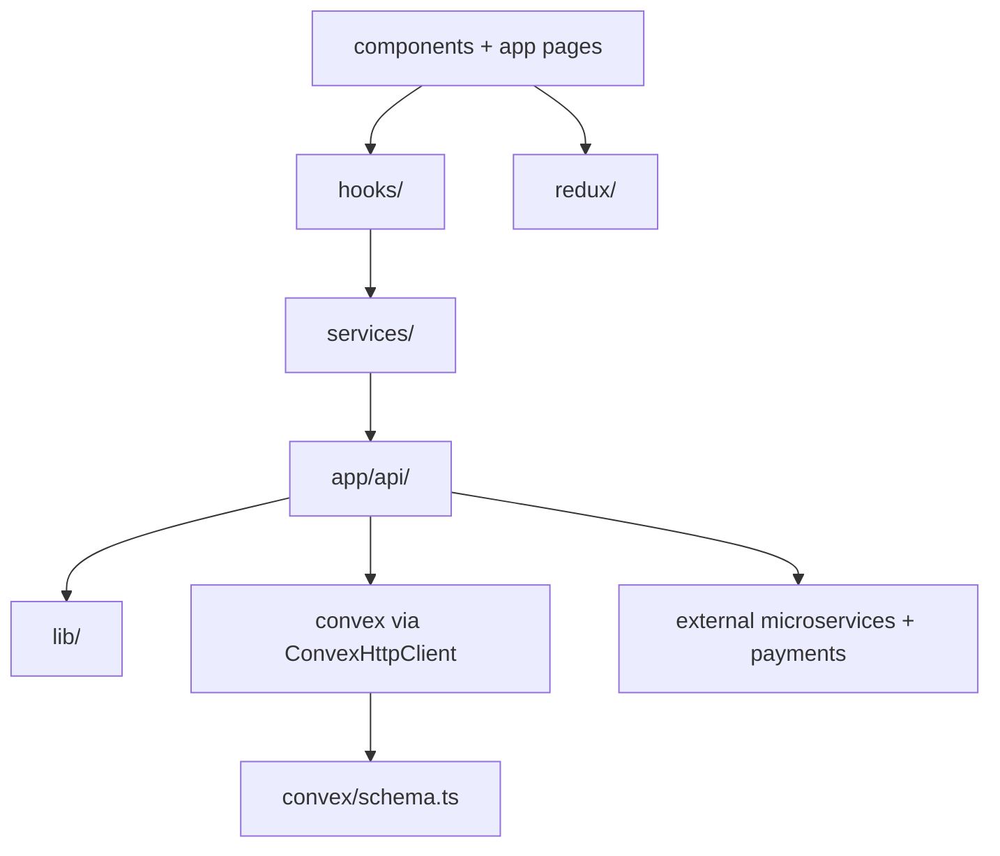

# Code Wiki — shothik-web

Standalone Next.js + Convex repository for the production Shothik AI web experience, including UI, API routes, Convex backend functions, and integrations (payments, LLM providers, external microservices).

## Contents

- [1. Architecture Overview](#1-architecture-overview)
- [2. Repository Map](#2-repository-map)
- [3. Runtime Flows](#3-runtime-flows)
- [4. Major Modules](#4-major-modules)
- [5. Key APIs (Classes / Functions)](#5-key-apis-classes--functions)
- [6. Dependency Relationships](#6-dependency-relationships)
- [7. Running the Project](#7-running-the-project)
- [8. Testing & CI](#8-testing--ci)
- [9. Extension Guides](#9-extension-guides)

## 1. Architecture Overview

### 1.1 Tech Stack

- Web framework: Next.js App Router ([app/](file:///workspace/app))
- Language: TypeScript (plus some `.jsx` legacy components) ([tsconfig.json](file:///workspace/tsconfig.json))
- Backend-in-repo: Convex functions and schema ([convex/](file:///workspace/convex), [schema.ts](file:///workspace/convex/schema.ts))
- Client state: Redux Toolkit + RTK Query ([redux/](file:///workspace/redux), [store.ts](file:///workspace/redux/store.ts))
- UI primitives: Radix UI + shadcn-style components ([components/ui/](file:///workspace/components/ui))
- Testing: Vitest + Playwright ([vitest.config.ts](file:///workspace/vitest.config.ts), [e2e/](file:///workspace/e2e))
- Package manager: pnpm ([package.json](file:///workspace/package.json))

### 1.2 High-Level System Diagram

```mermaid
flowchart LR
  U[Browser Client] --> N[Next.js App Router]
  N --> UI[components + hooks + redux]
  N --> API[app/api Route Handlers]
  API --> CVX[Convex Cloud Functions]
  API --> EXT[External Services\n(plagiarism/NLP/AI detector/etc.)]
  API --> PAY[Payments\n(Stripe/Razorpay/bKash)]
  API --> REDIS[Redis/Upstash\n(rate limit + idempotency)]
  N --> OBS[Analytics/Monitoring\n(PostHog, logs, health)]
```

### 1.3 Key Entrypoints

- Next.js UI routes/layouts: [app/](file:///workspace/app)
- Next.js API Route Handlers: [app/api/](file:///workspace/app/api)
- Convex schema (data model): [schema.ts](file:///workspace/convex/schema.ts)
- Optional custom Socket.io + Next server (paraphrase streaming): [server.ts](file:///workspace/server.ts)
- Next configuration (including rewrite fallback): [next.config.ts](file:///workspace/next.config.ts)

## 2. Repository Map

```text
/workspace
  app/                  Next.js App Router routes + API route handlers
  components/           Feature components + shadcn/radix UI primitives
  config/               Navigation/seo/env + project constants
  convex/               Convex schema + queries/mutations/actions + generated bindings
  hooks/                React hooks (feature orchestration)
  i18n/                 Locale files + locale sync hooks
  lib/                  Shared business logic + integrations (LLM, payments, security, etc.)
  providers/            React context providers (auth, query, convex, etc.)
  redux/                Redux store + slices + RTK query API slices
  services/             Client/service adapters (tools, presentation, upload, etc.)
  utils/                Cross-cutting utilities used by features
  docs/                 Engineering documentation (this wiki lives here)
```

## 3. Runtime Flows

### 3.1 Typical UI Page Flow

1. A route under [app/](file:///workspace/app) renders a page (server or client component).
2. Feature UI uses hooks under [hooks/](file:///workspace/hooks) and/or Redux state.
3. Data is fetched via:
   - Next route handlers under [app/api/](file:///workspace/app/api), or
   - Convex directly (via generated API), depending on feature.

### 3.2 “Tool” API Flow (paraphrase/grammar/summarize/etc.)

Representative implementation: [tools/paraphrase route](file:///workspace/app/api/tools/paraphrase/route.ts)

Common steps:

1. Enforce per-user (or anonymous) usage limits via Convex-backed checks:
   - [enforceUsageLimit](file:///workspace/lib/usage-enforcement.ts#L51-L136)
2. Apply tier-aware rate limiting:
   - [checkTieredToolRateLimit](file:///workspace/lib/tool-rate-limiter.ts)
3. Validate request payload:
   - Schemas in [validation.ts](file:///workspace/lib/validation.ts) (e.g., `paraphraseRequestSchema`)
4. Execute tool logic:
   - Local microservice (when enabled), or
   - LLM provider via gateway: [completeForTool](file:///workspace/lib/llm/gateway.ts#L252-L278)
5. Record usage back into Convex:
   - [recordToolUsage](file:///workspace/lib/usage-enforcement.ts#L138-L152)

### 3.3 External Service Fallback Pattern (example: plagiarism)

Representative implementation: [tools/plagiarism/analyze route](file:///workspace/app/api/tools/plagiarism/analyze/route.ts)

- Primary call: external API (`PLAGIARISM_API_URL`)
- Fallback: local engine (`PLAGIARISM_ENGINE_URL`), for retryable upstream failures/timeouts
- Anonymous callers have a dedicated, stricter rate limiter via [getRateLimitKey](file:///workspace/lib/rateLimiter.ts#L107-L116)

### 3.4 Health / Observability

Representative implementation: [health route](file:///workspace/app/api/health/route.ts)

- `GET /api/health`: basic liveness
- `GET /api/health?deep=true`: checks Convex + backend + microservices
- `GET /api/health?metrics=true`: returns runtime metrics (admin-key protected outside dev)

## 4. Major Modules

### 4.1 `app/` — Routing, Layout, and API Handlers

Responsibilities:

- App Router layouts, loading/error boundaries, pages
- HTTP API surface via route handlers under [app/api/](file:///workspace/app/api)

Notable API areas (non-exhaustive):

- Tool endpoints: [app/api/tools/](file:///workspace/app/api/tools)
- Twin endpoints: [app/api/twin/](file:///workspace/app/api/twin)
- Payments:
  - Stripe credits/subscription/stars/connect: [app/api/stripe/](file:///workspace/app/api/stripe)
  - Razorpay credits: [app/api/razorpay/](file:///workspace/app/api/razorpay)
  - bKash credits: [app/api/bkash/](file:///workspace/app/api/bkash)
- Publishing: [app/api/publish/](file:///workspace/app/api/publish)
- Writing Studio: [app/api/writing-studio/](file:///workspace/app/api/writing-studio)

### 4.2 `components/` — UI Components

Responsibilities:

- Feature components (agents, plagiarism UI, writing studio, discovery feed, etc.)
- Shared UI primitives:
  - Radix/shadcn-style components in [components/ui/](file:///workspace/components/ui)

Practical guidance:

- Feature-level components tend to live under a domain folder (e.g., [components/plagiarism/](file:///workspace/components/plagiarism)).
- UI primitives are reusable and should stay un-opinionated about business logic.

### 4.3 `hooks/` — Feature Orchestration Hooks

Responsibilities:

- Encapsulate client-side workflows (polling, streaming, tool calls, autosave, etc.)
- Bridge UI components to Redux/RTK Query and API routes

Examples:

- Writing workflows: [useWritingInsights.ts](file:///workspace/hooks/useWritingInsights.ts), [useConvexAutosave.ts](file:///workspace/hooks/useConvexAutosave.ts)
- Plagiarism: [usePlagiarismReport.ts](file:///workspace/hooks/usePlagiarismReport.ts)
- Chat/research: [useChat.js](file:///workspace/hooks/useChat.js), [useResearchStream.js](file:///workspace/hooks/useResearchStream.js)

### 4.4 `redux/` — Global Client State

Responsibilities:

- Persistent UI state (tool settings, editor state, history, auth slices)
- RTK Query API slices for network-driven state

Entrypoint:

- Store composition: [store.ts](file:///workspace/redux/store.ts)

Pattern:

- `redux/slices/*`: UI state reducers
- `redux/api/*`: RTK Query endpoints (fetching/mutations + caching)

### 4.5 `convex/` — Backend Data + Business Logic

Responsibilities:

- Primary application data model (tables, indexes): [schema.ts](file:///workspace/convex/schema.ts)
- Server functions (queries/mutations/actions) for core domains:
  - subscription/credits: [subscriptions.ts](file:///workspace/convex/subscriptions.ts), [credits.ts](file:///workspace/convex/credits.ts)
  - writing/projects/books/publishing: [projects.ts](file:///workspace/convex/projects.ts), [books.ts](file:///workspace/convex/books.ts), [publishing.ts](file:///workspace/convex/publishing.ts)
  - twin: [twin.ts](file:///workspace/convex/twin.ts)

Generated bindings:

- [convex/_generated/](file:///workspace/convex/_generated) is generated; code imports `api.*` from there (example: [usage-enforcement.ts](file:///workspace/lib/usage-enforcement.ts#L3-L4)).

### 4.6 `lib/` — Shared Business Logic & Integrations

Responsibilities:

- Route-handler building blocks (auth, rate limit, usage enforcement)
- LLM gateway + tool quality logic
- External integrations (Stripe, Redis, doc parsing, MCP)
- Security helpers (idempotency, sanitization, monitoring)

High-signal areas:

- Auth + API protection: [api-middleware.ts](file:///workspace/lib/api-middleware.ts)
- LLM routing + fallback: [gateway.ts](file:///workspace/lib/llm/gateway.ts)
- Rate limiting: [rateLimiter.ts](file:///workspace/lib/rateLimiter.ts)
- Usage enforcement (Convex-backed): [usage-enforcement.ts](file:///workspace/lib/usage-enforcement.ts)
- Idempotency (Upstash Redis): [idempotency.ts](file:///workspace/lib/security/idempotency.ts)
- Logging: [logger.ts](file:///workspace/lib/logger.ts)
- Twin execution engine: [lib/twin/](file:///workspace/lib/twin)

### 4.7 `services/` — Service Layer / Adapters

Responsibilities:

- Implement higher-level API calling patterns, caching and orchestration for features.
- Provide “service objects” used by UI and hooks.

Examples:

- Tool services: [paraphrase.service.ts](file:///workspace/services/paraphrase.service.ts), [plagiarismService.ts](file:///workspace/services/plagiarismService.ts)
- Presentation orchestration: [PresentationOrchestrator.js](file:///workspace/services/presentation/PresentationOrchestrator.js)

### 4.8 `config/`, `i18n/`, `providers/`

- Configuration: env and URLs in [config/](file:///workspace/config)
- Localization: locale JSON + sync helpers in [i18n/](file:///workspace/i18n)
- Providers: app-level providers in [providers/](file:///workspace/providers)

## 5. Key APIs (Classes / Functions)

### 5.1 API Protection & Auth

- `withApiProtection(handler, options)` wraps Next Route Handlers with:
  - rate limiting via [checkRateLimit](file:///workspace/lib/rateLimiter.ts#L72-L86)
  - optional bearer auth verification via [verifyAuthToken](file:///workspace/lib/api-middleware.ts#L17-L51)
  - structured logging via [logger](file:///workspace/lib/logger.ts#L14-L126)
  - Source: [api-middleware.ts](file:///workspace/lib/api-middleware.ts)

### 5.2 Rate Limiting

- `checkRateLimit(identifier, config)`:
  - prefers Redis-based counter (`redisIncr`) when available
  - falls back to in-memory sliding window limiter
  - Source: [rateLimiter.ts](file:///workspace/lib/rateLimiter.ts)
- `getRateLimitKey(req, scope)`:
  - uses Authorization hash if present, else IP-based key
  - Source: [rateLimiter.ts](file:///workspace/lib/rateLimiter.ts#L107-L116)

### 5.3 Usage Enforcement (Subscription/Tier Limits)

- `enforceUsageLimit(req, toolName)`:
  - anonymous: daily in-memory limit by IP + tool
  - authenticated: uses Convex query `subscriptions.checkUsageLimit`
  - Source: [usage-enforcement.ts](file:///workspace/lib/usage-enforcement.ts)
- `recordToolUsage(userId, toolName)`:
  - Convex mutation `subscriptions.incrementUsage`
  - Source: [usage-enforcement.ts](file:///workspace/lib/usage-enforcement.ts#L138-L152)

### 5.4 LLM Gateway

Primary orchestration:

- `completeForTool(tool, request)`:
  - selects preferred provider by tool
  - uses a fallback chain if provider fails
  - enforces concurrency (`MAX_CONCURRENT_LLM`)
  - Source: [gateway.ts](file:///workspace/lib/llm/gateway.ts#L252-L278)

Provider implementations:

- `callGemini`, `callDeepSeek`, `callKimi` (each has env-guarded API keys and request timeouts)
- Source: [gateway.ts](file:///workspace/lib/llm/gateway.ts)

### 5.5 Idempotency (Upstash Redis)

- `checkIdempotency`, `markIdempotencyPending`, `storeIdempotency`, `completeIdempotency`
- Provides both:
  - an Express-style wrapper: `withIdempotency(handler, {resource})`
  - an App Router helper: `handleIdempotency(request, resource)`
- Source: [idempotency.ts](file:///workspace/lib/security/idempotency.ts)

### 5.6 Twin Task Execution

Representative route: [twin/tasks/execute route](file:///workspace/app/api/twin/tasks/execute/route.ts)

Flow:

1. Authenticate request: `authenticateTwinRequest` ([twin-api-auth.ts](file:///workspace/lib/twin-api-auth.ts))
2. Authorize action: `checkAbility` ([twin-route-guard.ts](file:///workspace/lib/twin-route-guard.ts))
3. Load task & profile from Convex via `createTwinClient` ([twin-convex.ts](file:///workspace/lib/twin-convex.ts))
4. Execute task using:
   - [executeTask](file:///workspace/lib/twin/task-executor.ts)
   - with a style profile from [get-style-profile.ts](file:///workspace/lib/twin/get-style-profile.ts)
5. Persist task status in Convex (`running` → `completed`/`failed`)

## 6. Dependency Relationships

### 6.1 Layering Rules (Observed)



Practical interpretation:

- `components/` should avoid calling low-level integrations directly; prefer hooks/services.
- `app/api/*` is where orchestration happens (auth/validation/rate limit + calling Convex/external services).
- `lib/` provides cross-cutting primitives (logging, auth, rate limiting, LLM gateway, security).
- `convex/` is the backend contract; most “source of truth” persistence lives there.

### 6.2 Configuration Dependencies

- Runtime URLs and keys are env-driven:
  - Reference file: [.env.example](file:///workspace/.env.example)
  - Detailed guide: [ENVIRONMENT_VARIABLES.md](file:///workspace/docs/ENVIRONMENT_VARIABLES.md)
- Next rewrite fallback to external API origin is defined in:
  - [next.config.ts](file:///workspace/next.config.ts#L45-L59)

## 7. Running the Project

Canonical instructions live in [README.md](file:///workspace/README.md).

### 7.1 Prerequisites

- Node.js 20.x
- pnpm 10.x

### 7.2 Install

```bash
pnpm install
```

### 7.3 Environment

```bash
cp .env.example .env.local
```

Minimum envs for most dev flows (varies by feature):

- `NEXT_PUBLIC_CONVEX_URL`
- `NEXT_PUBLIC_API_URL` (used for auth verification and other upstream calls in some routes/libs)

### 7.4 Development Server

```bash
pnpm dev
```

### 7.5 Optional: Custom Socket Server (Paraphrase streaming)

This is not wired into `pnpm dev` scripts; run explicitly if needed:

```bash
node --loader tsx server.ts
```

Source: [server.ts](file:///workspace/server.ts)

### 7.6 Production Build (with placeholder envs for build-time SDK init)

```bash
NEXT_PUBLIC_CONVEX_URL=https://placeholder.convex.cloud STRIPE_SECRET_KEY=sk_test_placeholder pnpm build
```

## 8. Testing & CI

### 8.1 Unit Tests

```bash
pnpm test
pnpm test:coverage
```

### 8.2 Typecheck

```bash
pnpm type-check
```

### 8.2.1 Current Status Notes (as of this repository snapshot)

In a clean install environment, the following issues prevent `pnpm type-check` / `pnpm test` from passing without additional setup:

- `test/setup.ts` imports `@testing-library/jest-dom`, but the package is not present in `devDependencies`, causing Vitest to fail module resolution.
- Several test files use `toBeInTheDocument`, `toHaveTextContent`, etc. matchers; TypeScript types for those matchers are missing unless the jest-dom types are installed and included.
- `lib/twin-machine.ts` imports `xstate`, but `xstate` is not present in `package.json`.
- `prisma.config.ts` imports `dotenv/config` and `prisma/config`; those modules are not present in `package.json` (this file may be intended for environments where Prisma tooling is installed separately).

### 8.3 E2E

- Playwright tests: [e2e/](file:///workspace/e2e)
- Configuration: [playwright.config.ts](file:///workspace/playwright.config.ts)

### 8.4 CI Workflows

- Main workflow: [ci.yml](file:///workspace/.github/workflows/ci.yml)

## 9. Extension Guides

### 9.1 Adding a New Tool API Route

1. Create a route handler under `app/api/tools/<tool>/route.ts`.
2. Validate inputs using Zod schema(s) in [validation.ts](file:///workspace/lib/validation.ts).
3. Enforce usage/rate limits:
   - [enforceUsageLimit](file:///workspace/lib/usage-enforcement.ts)
   - [checkTieredToolRateLimit](file:///workspace/lib/tool-rate-limiter.ts)
4. Execute:
   - via LLM gateway: [completeForTool](file:///workspace/lib/llm/gateway.ts), or
   - via a dedicated microservice endpoint.
5. Record usage with [recordToolUsage](file:///workspace/lib/usage-enforcement.ts#L138-L152).

### 9.2 Adding a New Convex Domain Function

1. Add/extend tables or indexes in [schema.ts](file:///workspace/convex/schema.ts).
2. Create query/mutation in an appropriate `convex/*.ts` module.
3. Regenerate bindings (Convex tooling) so imports under `convex/_generated/` update.
4. Call from Next route handlers or client code via the generated `api`.
